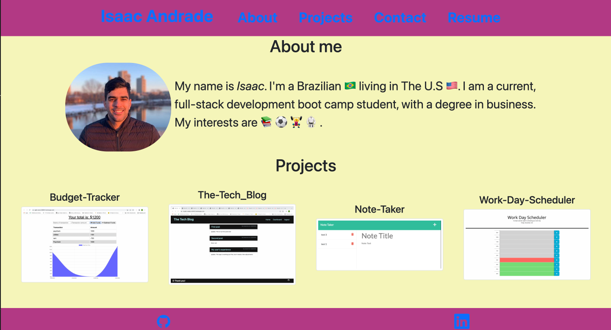
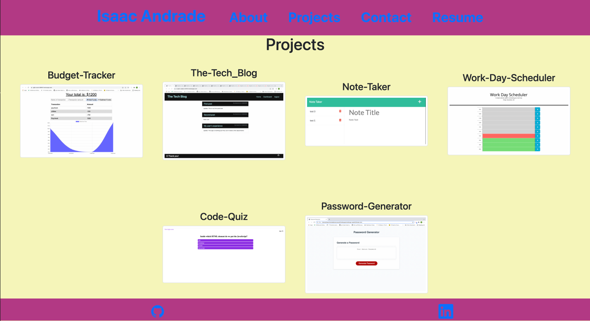
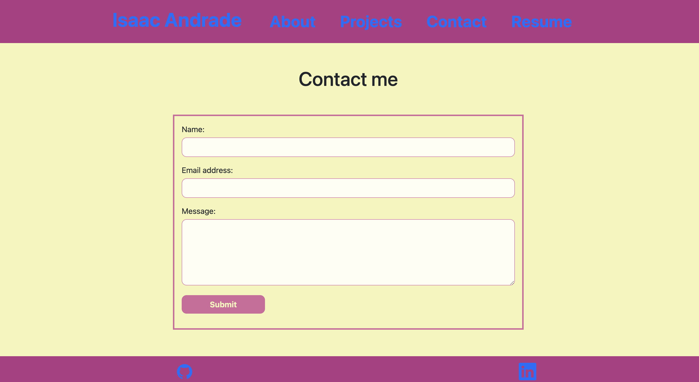
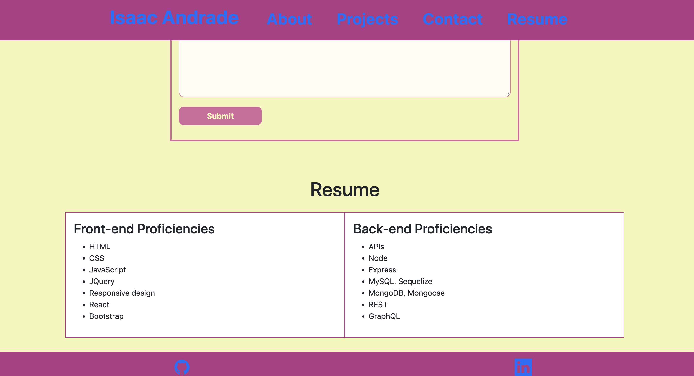

# Portfolio 

## Overview
This project was designed as a homework assignment for my coding bootcamp. The challenge was to create my portfolio as a React application, however, it doensn't include any back end functionality.

## Table of Contents
   - [Description](#description)
   - [Deployed Application](#deployed-application)
   - [Contributing](#contributing)
   - [Questions](#questions)

## Description
This single-page application fortfolio is presented with a page containing a few components: 
- Header
- Navigation (which has Header as parent)
- Footer
- About 
- Project
- Contact
- Resume

## Deployed Application
[Github page](http://isaaccna.github.io/portfolio-react/)

  ## Contributing
   Isaaccna
    
  ## Questions
   For any questions about the project, please visit my:  
   GitHub Profile: [isaaccna](https://github.com/isaaccna)  
   or  
   Email: @ isaac.andrade1231@gmail.com

